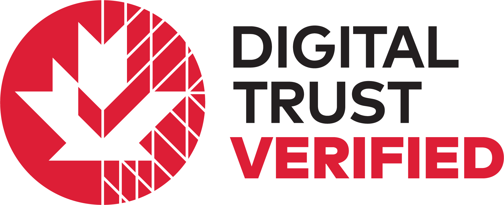

# Grant Registry

Official registry of grants issued by the Digital Governance Council.

## Grants

|No.|Cert. ID|Grantee|Topic|Sub-Scope|Focus|Applicable Standard(s), Tool(s)|Assesment Level|Date Issued|
|---|---|---|---|---|---|---|---|---|
|1|[DGC-VV-2024-01](./grants/DGC-VV-2024-01-FINAL-2024-01-04-SIGNED.pdf)|PlaceSpeak Inc.|Digital Identity|Trusted Digital Identity|Certified B Corporation|CAN/DGSI 103-1:2023|Class 1: Attestation Method|2024-01-04|
|2|[DGC-VV-2024-02](./grants/DGC-VV-2024-02-FINAL-2024-05-17-SIGNED.pdf)|Ontario Brain Institute|Health|Health Data and Information Capability Framework|Core HDI Capabilities|CAN/DGSI 105-5:2023|Class 2: Targeted Method|2024-05-17|
|3|[DGC-VV-2024-03](./grants/DGC-VV-2024-03-FINAL-2024-11-20-SIGNED.pdf)|Enigio AB|Digital Trade|Digital Trade Documentation|MLETR Reliable System Assessment|MLETR, ICC DSI/DGC MLETR Self-Assessment Tool|Class 1: Attestation Method|2024-11-18|
|4|[DGC-VV-2024-04](./grants/DGC-VV-2024-04-FINAL-2024-11-29-SIGNED.pdf)|AffinitiQuest|Digital Credentials| Conformity Assessment Scheme for Digital Credentials, Digital Trust Services, and Digital Wallets|Digital Credentials and Digital Trust Services|DGSI TS 115:2023, Technical Specification for Digital Credentials and Digital Trust Services|Class 1: Attestation Method|2024-11-29|
|5|[DGC-VV-2025-01](./grants/DGC-VV-2025-01-FINAL-2025-01-07-SIGNED.pdf)|myLaminin Corp.|Digital Credentials| Conformity Assessment Scheme for Digital Credentials, Digital Trust Services, and Digital Wallets|Digital Credentials and Digital Trust Services|DGSI TS 115:2023, Technical Specification for Digital Credentials and Digital Trust Services|Class 1: Attestation Method|2025-01-07|
|6|[DGC-VV-2025-02](./grants/DGC-VV-2025-02-FINAL-2025-01-14-SIGNED.pdf)|SECRO INC.|Digital Trade|Digital Trade Documentation|MLETR Reliable System Assessment|MLETR, ICC DSI/DGC MLETR Self-Assessment Tool|Class 1: Attestation Method|2025-01-14|
|7|[DGC-VV-2025-03](./grants/DGC-VV-2025-03-FINAL-2025-02-11-SIGNED.pdf)|CargoX Ltd.|Digital Trade|Digital Trade Documentation|MLETR Reliable System Assessment|MLETR, ICC DSI/DGC MLETR Self-Assessment Tool|Class 1: Attestation Method|2025-02-11|
|8|[DGC-VV-2025-04](./grants/DGC-VV-2025-04-FINAL-2025-02-28-SIGNED.pdf)|Global Shipping Business Network|Digital Trade|Digital Trade Documentation|MLETR Reliable System Assessment|MLETR, ICC DSI/DGC MLETR Self-Assessment Tool|Class 1: Attestation Method|2025-02-28|
|9|[DGC-VV-2025-05](./grants/DGC-VV-2025-05-FINAL-2025-04-01-SIGNED.pdf)|IQAX|Digital Trade|Digital Trade Documentation|MLETR Reliable System Assessment|MLETR, ICC DSI/DGC MLETR Self-Assessment Tool|Class 1: Attestation Method|2025-04-01|
|10|[DGC-VV-2025-06](./grants/DGC-VV-2025-06-FINAL-2025-05-16-SIGNED.pdf)|Credore|Digital Trade|Digital Trade Documentation|MLETR Reliable System Assessment|MLETR, ICC DSI/DGC MLETR Self-Assessment Tool|Class 1: Attestation Method|2025-05-16|
|11|[DGC-VV-2025-07](./grants/DGC-VV-2025-07-FINAL-2025-06-13-SIGNED.pdf)|SynergAI|Digital Trade|Digital Trade Documentation|MLETR Reliable System Assessment Validation|MLETR, ICC DSI/DGC MLETR Self-Assessment Tool|Class 1: Attestation Method|2025-06-13|
|12|[DGC-VV-2025-08](./grants/DGC-VV-2025-08-FINAL-2025-06-20-SIGNED.pdf)|BlockPeer Technologies, Inc.|Digital Trade|Digital Trade Documentation|MLETR Reliable System Assessment Validation|MLETR, ICC DSI/DGC MLETR Self-Assessment Tool|Class 1: Attestation Method|2025-06-20|
|13|[DGC-VV-2025-09](./grants/DGC-VV-2025-09-FINAL-2025-07-18-SIGNED.pdf)|IDENTOS, Inc.|Digital Trust|Digital Trust and Identity|Conformity Assessment Scheme for Digital Credentials, Digital Trust Services, and Digital Wallets|CAN/DGSI 103-2:2024 Digital Trust and Identity – Part 2: Delivery of Healthcare|Verification Review|2025-07-18|
|14|[DGC-VV-2025-10](./grants/DGC-VV-2025-10-FINAL-2025-08-01-SIGNED.pdf)|YodaPlus Technlogies Private Limited|Digital Trust|Digital Trade Documentation|MLETR Reliable System Assessment Verification|MLETR, ICC DSI/DGC MLETR Self-Assessment Tool|Verification Review|2025-08-01|
|15|[DGC-VV-2025-11](./grants/DGC-VV-2025-11-FINAL-2025-08-26-SIGNED.pdf)|Sequent Tech|Digital Trust|Online Electoral Voting|Municipal Elections|Technical design requirements for online voting services|Verification Review|2025-08-26|
|16|[DGC-VV-2025-12](./grants/DGC-VV-2025-12-FINAL-2025-09-11-SIGNED.pdf)|SGTraDex|Digital Trade|Digital Trade Documentation|MLETR Reliable System Assessment Verification|MLETR, ICC DSI/DGC MLETR Self-Assessment Tool|Verification Review|2025-09-11|
---
