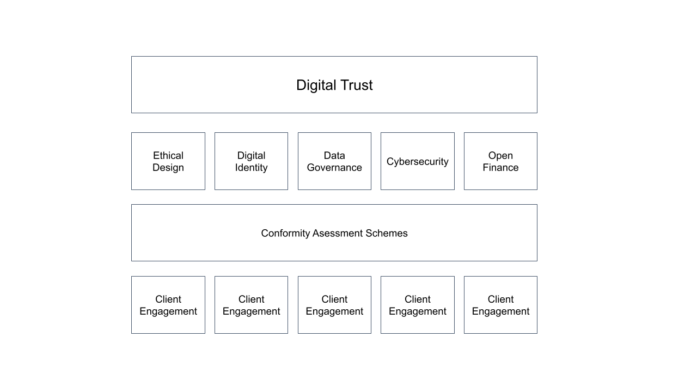

# Digital Trust

## Introduction

Digital trust refers to the confidence that people have in the security, reliability, and integrity of digital systems, devices, and services and these are operated in a fair, open and transparent manner. Digital Trust is an important concept in the digital age, as more and more aspects of our lives are mediated by technology and the internet.

Digital trust is overall expectation that digital technologies and services, including the organizations that provide these technologies and services will protect all stakeholders’ interests and uphold societal expectations and values.

There are numerous factors that contribute to digital trust, including the security of digital systems and devices, the privacy and confidentiality of personal information, the reliability and availability of digital services, and the transparency and accountability of the organizations that provide them. Building and maintaining digital trust requires ongoing efforts to protect against cyber threats, ensure the privacy and security of personal information, and be transparent and accountable in the use of digital technologies.

In order for individuals and organizations to feel confident in using digital systems and services, it is important for these systems to be secure, reliable, and trustworthy. This requires ongoing efforts to protect against cyber threats, ensure the privacy and security of personal information, and be transparent and accountable in the use of digital technologies.

## Digital Trust Certification

Digital trust certification is more than just an outcome of a certification process, or a mark of trustworthiness. It is a demonstration that certain standards or criteria have been met in the context of being recoginized as a reputable actor within the digital realm. Consideration of the digital realm is important because it can extend and have effect across many legal and political jurisidictions having varying levels of regulation and enforcement. Digital trust certification is intended to complement existing certification schemes by taking into the account the evolving nature of the digital realm including: codes of practice, new requirements, normative principles and emerging practices.

The figure, below, illustrates how things fit together:

## Digital Trust Principles

Using the broadest brush, digital trust is based on a common foundation of principles. In a digital world, individuals must be able to trust that their privacy is protected, that their data will not be misused, and that enitities communicate in a simple and straightforward manner with their users.

As a starting point, the digital trust certification program would abide by 10 principles tailored from [Canada's Digital Charter](https://www.ic.gc.ca/eic/site/062.nsf/%20eng/h_00108.html):

1. Universal Access
2. Safety and Security
3. Control and Consent
4. Transparency, Portability and Interoperability
5. Open and Modern Digital Government (Governance)
6. A Level Playing Field
7. Data and Digital for Good
8. Strong Democracy
9. Free from Hate and Violent Extremism
10. Strong Enforcement and Accountability

## Digital Trust Interoperability

Digital trust interoperability refers to the ability of different organizations, programs, systems and technologies to work together in a way that allows people to decide to trust and rely on the information and services provided by those systems. Depending on the context, this can involve a variety of different components, such as ensuring that different systems use common standards and protocols for exchanging data, that there are clear and transparent processes in place for verifying the accuracy and reliability of the information being shared, and that there are measures in place to protect privacy and security.

Digital trust interoperability is important because it helps to ensure that different organizations and systems can work together effectively and that people can rely on the information and services that they provide.

## System Reliability

System reliability is a key element underlying digital trust. System reliability ensures that digital services and platforms consistently function as expected, minimizing disruptions and outages. When users can rely on a system to be available and perform reliably, they are more likely to trust it with their personal information, financial transactions, and sensitive data. Consquently, t\rust in the digital realm is fragile and easily shattered by system failures. System reliability not only fosters trust but also upholds the integrity of the digital ecosystem, providing all stakeholders with the confidence they need to embrace and engage with each other.

## Digital Trust Conformity Assessment Scheme

The Digital Trust conformity assessment scheme is intended to facilitate trust interoperablity in the digital world - or digital trust interoperabilty - as described in the previous section. To achieve this, the conformity assessment scheme incorporates certification sub-scopes and specializations that fit under a single umbrella - digital trust.

* For suppliers, the digital trust scheme can be used to showcase their compliance to one or more recognized standards, certifications, accreditations, audit programs, and best practices.

* For purchasers, the digital trust scheme can be used assist in the overall digital ecosystem performance and procurement efficiency by quickly and easily identifying organizations that commit to standards, certifications and trust signals that are important to them.

## Complementing Trust Frameworks

A trust framework is a set of guidelines, principles, and standards that are used to establish and maintain trust between different parties. Trust frameworks can be used in a variety of contexts, such as between businesses, between organizations and their customers, or between government agencies and the public.

Similarly, a conformity assessment scheme is a set of procedures, standards, and guidelines that are used to evaluate whether a product, service, or system meets certain specified requirements or standards.

In many ways, trust frameworks and conformity assessment schemes can be seen as the same things - there are overlaps, but there are key differences:

Conformity assessment schemes are oriented toward *outputs*, while trrust frameworks are oriented more towards *outcomes*. Outputs refer to the products, services, or other tangible results that are generated by a system or process. Outcomes, on the other hand, refer to the broader effects or consequences of a system or process.

While there is no hard and fast distinction, outputs gengerally refer to tangible results of products and services. Outcomes typically refer to results that are intangible or long-term in nature and are more difficult a to measure and quantify.

The Digital Trust conformity assessment scheme is intended to support existing and emerging trust frameworks. Trust frameworks over time may evolve into standards and conformity assessment schemes as is case of the [Public Sector Profile of the Pan-Canadian Trust Framework](https://github.com/canada-ca/PCTF-CCP/tree/master/Version1_4) which forms the basis of [Trusted Digital Identity Profile](./digital-identity-profile.md)

## Assessment Class Level

Refer to [Assessment Class Level](./assessment-class-level.md)

### Tailoring Digital Trust Assessments

There is no 'one-fits-all approach'. In scoping out a digital trust assessment, the following steps are undertaken

|Component|Tailoring Considerations|Details|
|---|---|---|
|Main Scope|No Tailoring| Digital Trust in all cases.|
|Topic|Minimal Tailoring| Specification of the broader subject matter or discipline.|
|Sub-Scope|Tailoring to Specific Domain|Tailoring based on accepted practices, codes, etc., within the domain|
|Focus|Tailoring to Specific Focus|Restriction of scope to a specific focus or specialization.|
|Class Level|Tailoring to Engagement |Method of tailoring based on **Assessment Class Level**|
|Caveats|Tailoring for Unexpected Results/Findings|Any caveats resulting from the assessmsent|

## Caveats

A caveat is used to indicate a specific consideration, qualification or restriction that should be taken into account when relying on the certificate or grant. In the context of an assessment a caveat typically refers to a qualification or note that is added to the results or findings of the assessment. A caveat is a way of indicating that there are certain limitations, conditions, or factors that should be considered when interpreting or relying on the outcome of an assessment results. Caveats help to ensure that the resulting grant or certificate is accurately understood, not misinterpreted and when necessary, enable to granting authority to specifically define limits or boundaries related to the assessment's scope or focus.

[Link to Assessment Profiles](profiles-overview.md)

